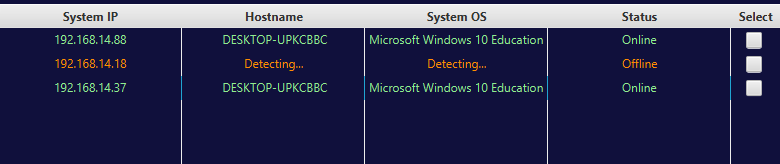
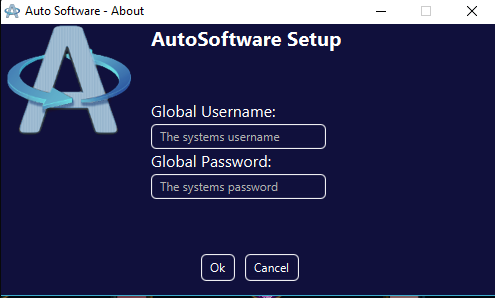
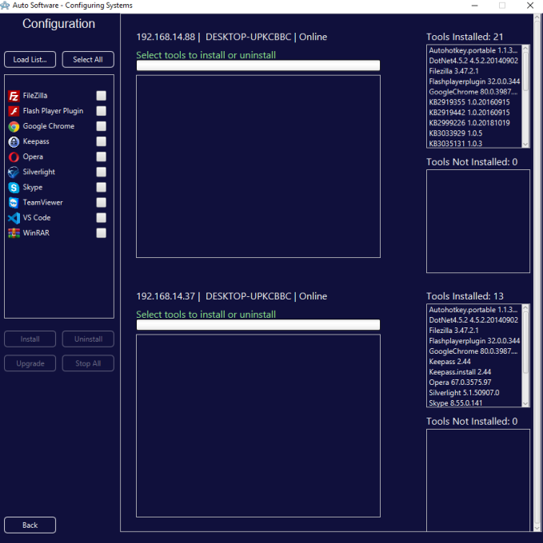
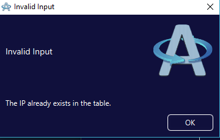

# Auto Software 
### **Languages:** Java, Batch using Chocolatey, PSTools and JavaFX
Automation of the installation, uninstallation and upgrade of software using Chocolatey to support automation and PSTools to support the execution of commands remotely.
The user interface was created using JavaFX

# Demonstration Video:
Coming soon

# Poster
Coming soon

# Project Report
Coming soon

### **Problem Solving techniques used/Notes:**
- Object Oriented 
- Concurrency
	- Future objects
	- Thread pools
	- Executors
- Chocolatey for install, upgrade, uninstall commands
- PSTools to execute all batch file commands to remote systems
- Blowfish Encryption

### **Screenshots**

**"Home" Scene**

**Systems added to the system table on the "Home" Scene**

**"Global Configuration" Scene**

**"About" Scene**

**"Configuration" Scene**

**Installation of Software phase on three virtual machines**

**Upgrade of Software phase on three virtual machines**

**Uninstall of Software phase on three virtual machines**

**Popup Dialogues**

**When attempting to install software that is already installed. Same applies for uninstall and upgrade**

